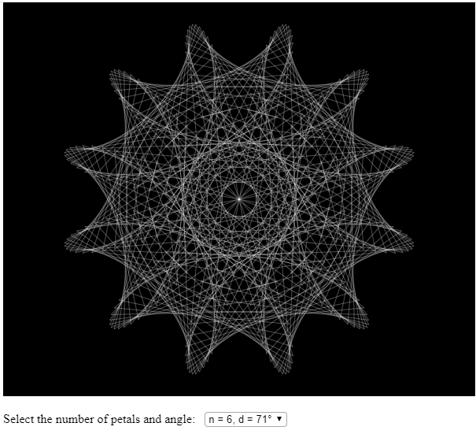

# Maurer Rose

  

## Description

Maurer rose algorithm based on **[wikipedia](https://en.wikipedia.org/wiki/Maurer_rose)** explanation using **[p5.js](https://p5js.org/)** to hanlde canvas redering.

## License

- **[MIT license](http://opensource.org/licenses/mit-license.php)**
